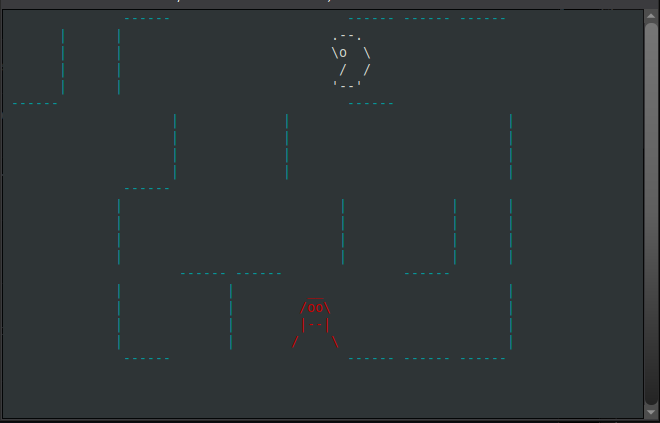

# terminal-pacman
This PacMan game clone runs on terminal.




## Running the game

```
git clone https://github.com/Akuli/terminal-pacman
cd terminal-pacman
python3 -m venv env
source env/bin/activate      # On Windows:  env\Scripts\activate, without source
pip install -r requirements.txt
python3 -m pacman
```

## Developing

In `terminal-pacman` folder, cloned as above, with venv active:

```
pip install -r requirements-dev.txt
```

Run `./lint` to run all linters at once (doesn't work on Windows).
